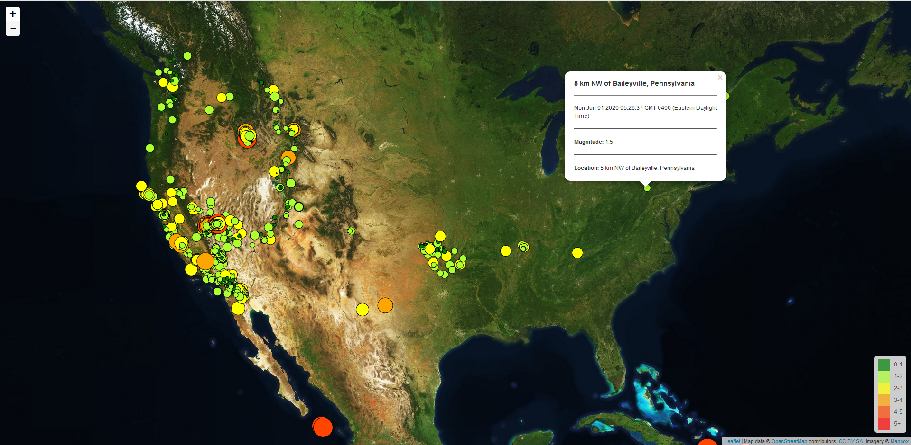

# leaftlet-challenge
## CWRU Data Analytics Bootcamp - Leaflet HW
---------------------------
## Objectives
* Read a GeoJSON into JS
* Use Mapbox to display an interactive map of earthquakes
* Provide a popup on click of each earthquake marker that provides additional information
* Create a legend to provide context to the data
----------------------------
### Contents
* <b>Leaflet-Step-1</b> - 1st part of the Assignment
  * <b>/static/css/style.css</b> - Contains CSS file with styles for legend on map
  * <b>/static/js/logic.js</b> - Reads the GeoJSON URL and plots earthquake datapoints on Mapbox map using JavaScript
  * <b>Index.html</b> - Webpage of Earthquake Map
----------------------------
### Results
<b>Part 1</b>

* Color coded legend
* Popup on click of marker that displays earthquake information
* Earthquake color dependant upon magnitude
